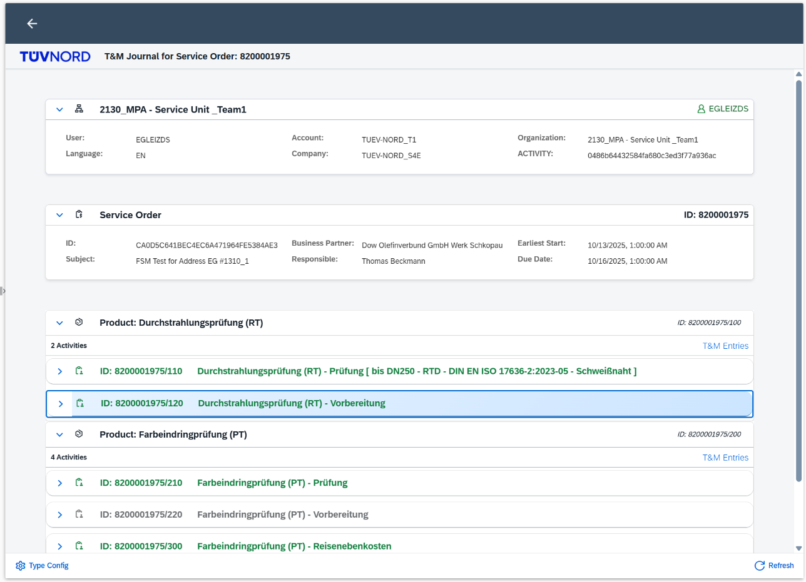
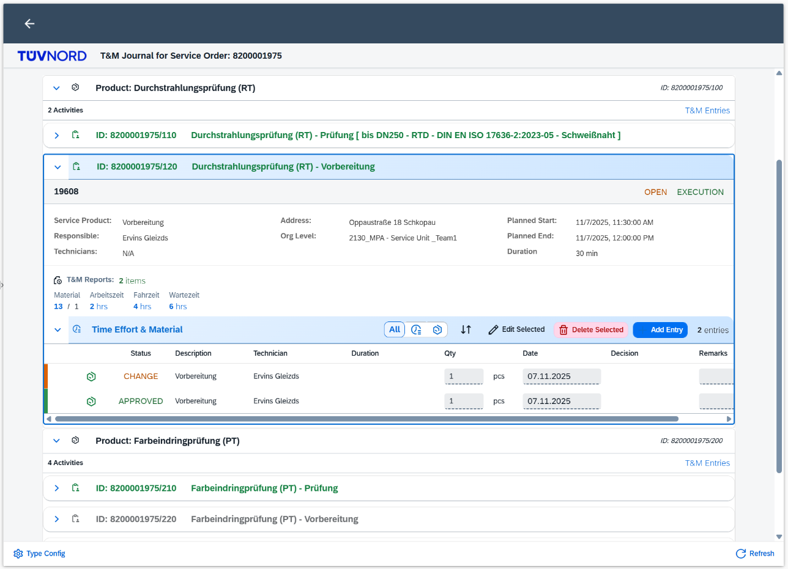
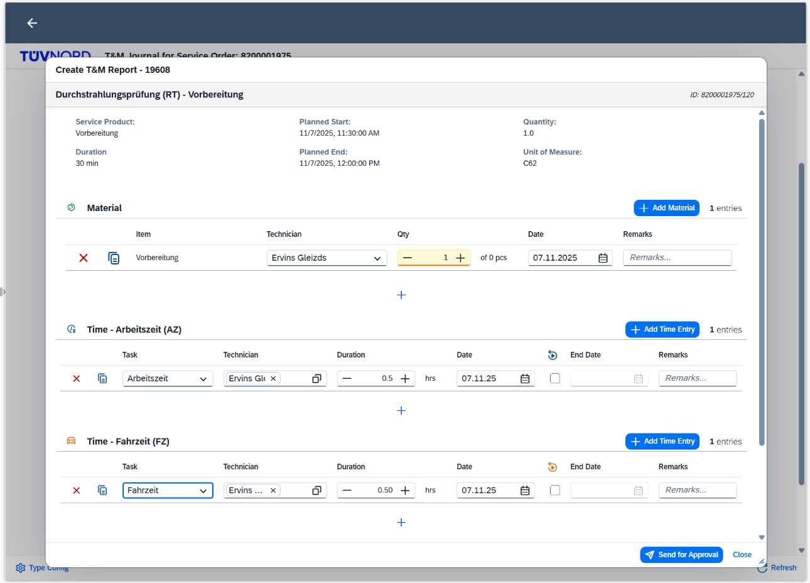
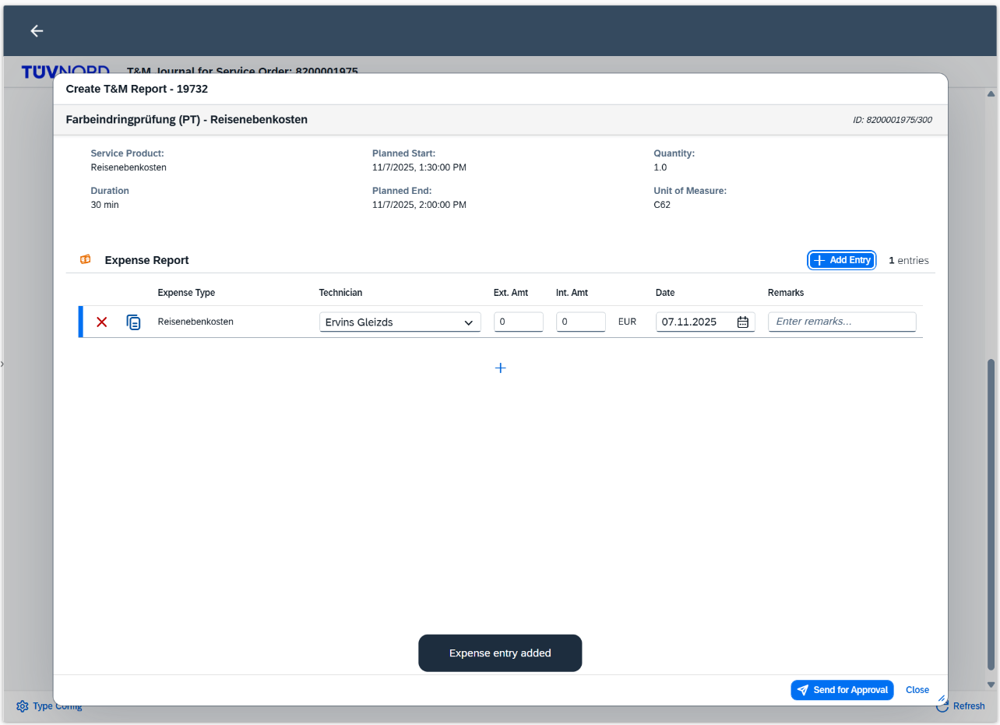
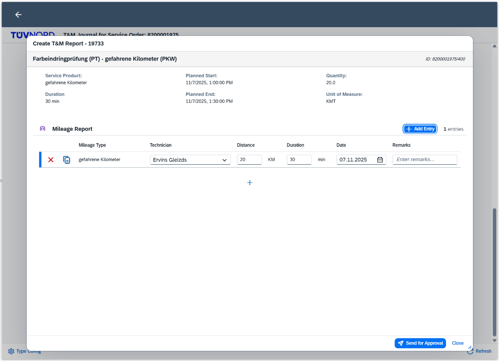
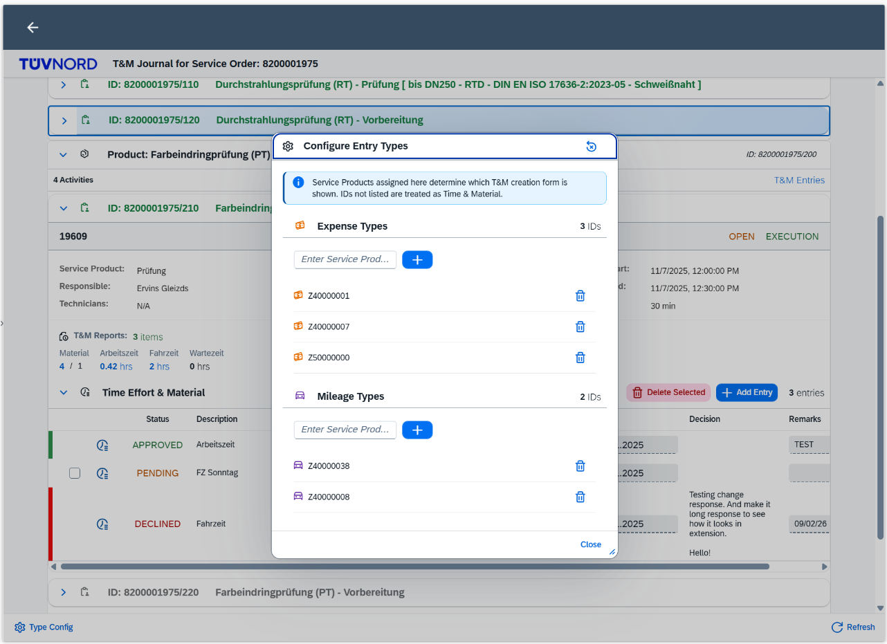
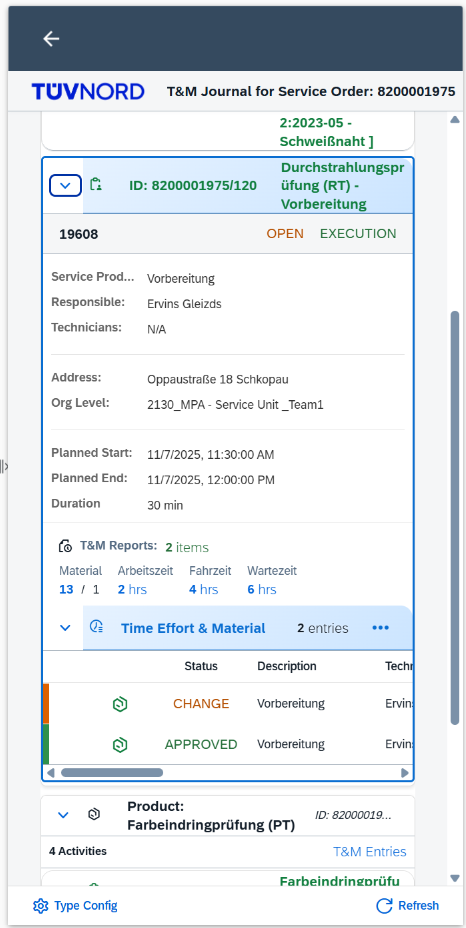

# T&M Journal - FSM Mobile Integration App

A SAP Fiori mobile application for SAP Field Service Management (FSM), designed to run in FSM Mobile (Web Container), FSM Web UI (Shell Extension), or standalone browser. Features T&M (Time & Materials) reporting with automatic organization level resolution, context-aware activity highlighting, and configurable entry types.

> **Version:** 0.0.1  
> **Platform:** SAP BTP Cloud Foundry  
> **Last Updated:** January 2026

---

## 📋 Table of Contents

- [Screenshots](#-screenshots)
- [Overview](#-overview)
- [Architecture](#-architecture)
- [Features](#-features)
- [Prerequisites](#-prerequisites)
- [Setup & Deployment](#-setup--deployment)
- [FSM Mobile Integration](#-fsm-mobile-integration)
- [FSM Web UI Integration](#-fsm-web-ui-integration)
- [Standalone / Development Mode](#-standalone--development-mode)
- [Expected Result](#-expected-result)
- [How It Works](#-how-it-works)
- [API Reference](#-api-reference)
- [Troubleshooting](#-troubleshooting)
- [Application Details](#-application-details)
- [Current Status](#-current-status)
- [Security Notes](#-security-notes)

---

## 📸 Screenshots

### 1. Main View - Session Context & Service Order

<!-- TODO: Add screenshot of main view showing Session Context panel and Service Order panel -->


| Element | Description | Key Files |
|---------|-------------|-----------|
| **Session Context Panel** | Shows User, Language, Account, Company, Organization, Object Type | `WebContainerContext_fragment.xml` |
| **Type Config Button (⚙️)** | Opens Type Configuration dialog | `View1_controller.js` → `onOpenTypeConfig()` |
| **Service Order Panel** | Expandable panel with Service Order details | `ServiceCall_fragment.xml` |

---

### 2. Product Groups & Activities

<!-- TODO: Add screenshot showing Product Groups with expanded Activity panel -->


| Element | Description | Key Files |
|---------|-------------|-----------|
| **Product Group Headers** | Activities grouped by Service Product description | `ProductGroups_fragment.xml`, `ProductGroupService.js` |
| **Activity Panel** | Expandable panel with activity details | `ProductGroups_fragment.xml` |
| **Context Highlighting** | Light blue border on entry activity | `style.css` → `.contextActivityPanel` |
| **T&M Summary** | Count of Time, Material, Expense, Mileage entries | `ProductGroups_fragment.xml`, `TMDataService.js` |
| **Create T&M Button** | Opens T&M Creation dialog | `TMDialogService.js` → `openTMCreationDialog()` |
| **View T&M Button** | Opens T&M Reports dialog | `TMDialogService.js` → `openTMReportsDialog()` |

---

### 3. T&M Creation Dialog - Time & Material

<!-- TODO: Add screenshot of T&M Creation dialog showing Time & Material form -->


| Element | Description | Key Files |
|---------|-------------|-----------|
| **Activity Header** | Shows activity details (dates, duration, quantity) | `TMCreateDialog_fragment.xml` |
| **Material Section** | Technician, Item, Quantity, Remarks | `TMCreateDialog_fragment.xml`, `TMCreationService.js` |
| **Time Sections** | Arbeitszeit, Fahrzeit, Wartezeit with Task dropdown | `TMCreateDialog_fragment.xml` |
| **Technician Input** | Suggestions from 4000+ technicians | `TechnicianService.js`, `TechnicianMixin.js` |
| **Task Dropdown** | Filtered by category (AZ, FZ, WZ) | `TimeTaskService.js` |
| **Save Buttons** | Save, Send for Approval, Done | `TMDialogMixin.js`, `TMSaveMixin.js` |

**Visibility:** Shows when Service Product ID is NOT in Expense or Mileage type lists.

**Type Check:** `TypeConfigService.isTimeMaterialType(serviceProductId)`

---

### 4. T&M Creation Dialog - Expense

<!-- TODO: Add screenshot of T&M Creation dialog showing Expense form -->


| Element | Description | Key Files |
|---------|-------------|-----------|
| **Expense Form** | Technician, Item, Amount fields | `TMCreateDialog_fragment.xml` |
| **External Amount** | Amount charged to customer | `TMExpenseMileageMixin.js` |
| **Internal Amount** | Internal cost amount | `TMExpenseMileageMixin.js` |
| **Charge Option** | Dropdown for billing type | `TMCreateDialog_fragment.xml` |

**Visibility:** Shows when Service Product ID is in Expense type list.

**Default IDs:** Z40000001, Z40000007, Z50000000

**Type Check:** `TypeConfigService.isExpenseType(serviceProductId)`

---

### 5. T&M Creation Dialog - Mileage

<!-- TODO: Add screenshot of T&M Creation dialog showing Mileage form -->


| Element | Description | Key Files |
|---------|-------------|-----------|
| **Mileage Form** | Distance, route, driver fields | `TMCreateDialog_fragment.xml` |
| **Distance** | Kilometers/miles traveled | `TMExpenseMileageMixin.js` |
| **Source / Destination** | Route start and end points | `TMCreateDialog_fragment.xml` |
| **Driver Checkbox** | Indicates if technician was driver | `TMCreateDialog_fragment.xml` |
| **Private Car Checkbox** | Indicates if private vehicle used | `TMCreateDialog_fragment.xml` |

**Visibility:** Shows when Service Product ID is in Mileage type list.

**Default IDs:** Z40000038, Z40000008

**Type Check:** `TypeConfigService.isMileageType(serviceProductId)`

---

### 6. T&M Reports Dialog

<!-- TODO: Add screenshot of T&M Reports dialog showing existing entries -->


| Element | Description | Key Files |
|---------|-------------|-----------|
| **Entry Panels** | Expandable panels for each T&M entry | `ProductGroups_fragment.xml` |
| **Multi-line Header** | Type, Item ID, Description | `TMDataService.js` |
| **Entry Details** | All fields with resolved names | Lookup services (`PersonService.js`, `ItemService.js`, etc.) |
| **Approval Status** | Shows decision status | `ApprovalService.js` |
| **Edit Button** | Opens entry for editing | `TMEditMixin.js`, `TMEditService.js` |

---

### 7. Type Configuration Dialog

<!-- TODO: Add screenshot of Type Configuration dialog -->


| Element | Description | Key Files |
|---------|-------------|-----------|
| **Info Message** | Explains how type configuration works | `TypeConfigDialog_fragment.xml` |
| **Expense Types List** | Service Product IDs treated as Expense | `TypeConfigDialog_fragment.xml` |
| **Mileage Types List** | Service Product IDs treated as Mileage | `TypeConfigDialog_fragment.xml` |
| **Add Input** | Input field to add new type ID | `View1_controller.js` → `onAddExpenseType()`, `onAddMileageType()` |
| **Remove Button** | Delete icon to remove type ID | `View1_controller.js` → `onRemoveExpenseType()`, `onRemoveMileageType()` |
| **Reset Button** | Resets to default configuration | `View1_controller.js` → `onResetTypeConfig()` |

**Backend:** `TypeConfigStore.js` (file storage), `/api/*-type-config` endpoints

**Frontend:** `TypeConfigService.js` (API client, type checking)

---

### 8. Mobile Responsive View

<!-- TODO: Add screenshot showing app on mobile device or narrow screen -->


| Element | Description | Key Files |
|---------|-------------|-----------|
| **Responsive Layout** | 3→2→1 column layout based on screen width | `style.css` |
| **Collapsed Panels** | Panels collapse to save space | All fragment XML files |
| **Touch-friendly** | Larger touch targets for mobile | `style.css` |

**Breakpoints:**
- Desktop: 3 columns (>1200px)
- Tablet: 2 columns (768px-1200px)
- Mobile: 1 column (<768px)

---

### Screenshot Checklist

| # | Screenshot | Status |
|---|------------|--------|
| 1 | Main View (Session Context + Service Order) | ⬜ TODO |
| 2 | Product Groups & Activities | ⬜ TODO |
| 3 | T&M Creation - Time & Material | ⬜ TODO |
| 4 | T&M Creation - Expense | ⬜ TODO |
| 5 | T&M Creation - Mileage | ⬜ TODO |
| 6 | T&M Reports Dialog | ⬜ TODO |
| 7 | Type Configuration Dialog | ⬜ TODO |
| 8 | Mobile Responsive View | ⬜ TODO |

**Screenshot folder:** `docs/screenshots/`

---

## 🎯 Overview

This application provides a mobile-optimized interface for viewing and managing FSM activities with T&M (Time & Materials) reporting. It integrates seamlessly with FSM Mobile through Web Container integration.

**Key Features:**
- ✅ Progressive disclosure UI (Service Order → Product Groups → Activities → T&M Reports)
- ✅ Organization level auto-resolution from logged-in user
- ✅ Activities grouped by Product Description
- ✅ Auto-loads activity data from FSM Mobile web container context
- ✅ Context activity highlighting (light blue SAP Fiori styling)
- ✅ T&M Reports viewing and creation:
  - **Time & Material Report** - For standard service products (Material + Time entries)
  - **Expense Report** - For expense service products
  - **Mileage Report** - For mileage service products
- ✅ **Configurable Entry Types** - Expense and Mileage Service Product IDs can be configured via UI
- ✅ Session context display (User, Account, Company, Organization)
- ✅ Mobile-first responsive design
- ✅ Secure authentication via SAP BTP Destination Service
- ✅ Direct FSM API integration

**Default Type Configuration:**
| Type | Default Service Product IDs |
|------|----------------------------|
| Expense | Z40000001, Z40000007, Z50000000 |
| Mileage | Z40000038, Z40000008 |
| Time & Material | All other IDs |

*Note: Type configuration can be modified at runtime via the "Type Config" button.*

**Technology Stack:**
- **Frontend:** SAP UI5 (Fiori)
- **Backend:** Node.js + Express
- **Deployment:** SAP Business Technology Platform (Cloud Foundry)
- **Authentication:** OAuth 2.0 via BTP Destination Service

---

## 🏗️ Architecture

The application supports **multiple deployment contexts**:

| Context | Description | How It Works |
|---------|-------------|--------------|
| **FSM Mobile** | Web Container in FSM Mobile app | POST context to `/web-container-access-point` |
| **FSM Web UI** | Extension in FSM Web application | fsm-shell SDK communicates via iframe |
| **Standalone** | Direct browser access | URL parameters (`?activityId=...` or `?serviceCallId=...`) |
```
┌──────────────────────────────────────────────────────────────────────────┐
│                         ENTRY POINTS                                     │
├──────────────────┬───────────────────────┬───────────────────────────────┤
│   FSM Mobile     │     FSM Web UI        │     Standalone/Dev            │
│   (Web Container)│     (Shell Extension) │     (URL Parameters)          │
│        │         │           │           │            │                  │
│  POST context    │   fsm-shell SDK       │   ?activityId=XXX             │
│        │         │   (iframe postMessage)│   ?serviceCallId=XXX          │
└────────┼─────────┴───────────┼───────────┴────────────┼──────────────────┘
         │                     │                        │
         └─────────────────────┼────────────────────────┘
                               ▼
┌─────────────────────────────────────────────────────────────────────────┐
│                      SAP BTP (Cloud Foundry)                            │
│  ┌───────────────────────────────────────────────────────────────────┐  │
│  │                      UI5 App (Frontend)                           │  │
│  │                                                                   │  │
│  │  ContextService.js - Detects environment & unifies context        │  │
│  │       ↓                                                           │  │
│  │  1. T&M Journal Page (Service Order header)                       │  │
│  │  2. Session Context Panel (User, Org, Account, Company)           │  │
│  │  3. Organization Level (auto-resolved from user)                  │  │
│  │  4. Product Groups → Activities (grouped view)                    │  │
│  │  5. T&M Reports Dialog (view/edit existing)                       │  │
│  │  6. T&M Creation Dialog (create new entries)                      │  │
│  │  7. Type Config Dialog (configure entry types)                    │  │
│  └───────────────────────────┬───────────────────────────────────────┘  │
│                              │                                          │
│  ┌───────────────────────────▼───────────────────────────────────────┐  │
│  │                   Express Server (Backend)                        │  │
│  │                                                                   │  │
│  │  - Web Container Context Storage (for FSM Mobile)                 │  │
│  │  - FSM API Proxy (authenticated via BTP Destination)              │  │
│  │  - Type Config API (CRUD for entry types)                         │  │
│  │  - Type Config Store (typeconfig.json)                            │  │
│  └───────────────────────────┬───────────────────────────────────────┘  │
└──────────────────────────────┼──────────────────────────────────────────┘
                               │ OAuth Token
                               ▼
                      ┌─────────────────┐
                      │ BTP Destination │  (FSM_S4E destination)
                      │    Service      │
                      └────────┬────────┘
                               │ Authenticated Request
                               ▼
                      ┌─────────────────┐
                      │     FSM API     │  (SAP Field Service Management)
                      │                 │
                      │  - User & Organization Data
                      │  - Service Calls (Composite Tree)
                      │  - Activities & T&M Reports
                      │  - Lookup Data (Tasks, Items, Expense Types, etc.)
                      └─────────────────┘
```

---

## ✨ Features

### UI Components

| Component | Description |
|-----------|-------------|
| **Session Context Panel** | Shows User, Language, Account, Company, Organization, Object Type/ID (visible in all contexts) |
| **Service Order Panel** | Expandable panel showing Service Order details (ID, External ID, Subject, Business Partner, Responsible, Dates) |
| **Organization Level** | Auto-resolved from logged-in user (no manual selection required) |
| **Product Groups** | Activities grouped by Product Description with activity count |
| **Activity Panels** | Expandable panels with context highlighting (blue border for entry activity), Address, Responsible, Org Level, Service Product, T&M Summary |
| **T&M Summary** | Shows count of Time Effort, Material, Expense, Mileage reports per activity |
| **T&M Reports Dialog** | Detailed view of all T&M entries with expandable panels, Edit/Approval buttons, multi-line headers |
| **T&M Creation Dialog** | Create new T&M entries based on Activity Service Product type |
| **Type Config Dialog** | Configure which Service Product IDs are treated as Expense, Mileage, or Time & Material |

### Lookup Services

The app resolves FSM IDs to human-readable names:

| Service | Resolves | Example |
|---------|----------|---------|
| **PersonService** | Person ID/ExternalId → Name | `A1B2C3D4...` → `Max Mustermann (ZZ00094912)` |
| **TechnicianService** | Technician suggestions | Large dataset handling with Input suggestions |
| **TimeTaskService** | Task ID → Name | `3010642C...` → `AZ - Arbeitszeit` |
| **ItemService** | Item ID/ExternalId → Name | `MATNR001` → `MATNR001 - Schrauben M8` |
| **ExpenseTypeService** | Expense Type ID → Name | `6DC882E6...` → `Z40000039 - Aktivierungs-/Einsatzpauschale` |
| **UdfMetaService** | UDF Meta ID → ExternalId | `EB1C5C15...` → `Z_Mileage_MatID` |
| **OrganizationService** | Org Level ID → Name + User Resolution | `2B6F7485...` → `2130_MPA - Service Unit _Team1` |
| **BusinessPartnerService** | BP ExternalId → Name | `55003748` → `Company Name (55003748)` |
| **ApprovalService** | Object ID → Decision Status | `F1E2D3C4...` → `Approved` |
| **TypeConfigService** | Service Product ID → Entry Type | `Z40000001` → `Expense` |

### T&M Entry Types (Creation)

Entry type shown depends on Activity Service Product. **Types are configurable via Type Config Dialog.**

| Entry Type | Default Service Product IDs | Key Fields |
|------------|----------------------------|------------|
| **Expense Report** | Z40000001, Z40000007, Z50000000 | Technician, Item, External/Internal Amount, Charge Option, Remarks |
| **Mileage Report** | Z40000038, Z40000008 | Technician, Item, Distance, Source, Destination, Driver, Private Car, Remarks |
| **Time & Material Report** | All other IDs | Material section (Technician, Item, Quantity, Remarks) + Time sections (Arbeitszeit, Fahrzeit, Wartezeit with Task, Duration, Remarks) |

*Note: Default Service Product IDs can be modified at runtime via the "Type Config" button (⚙️) in the Session Context panel or footer toolbar.*

### T&M Report Types (Viewing)

| Type | Key Fields |
|------|------------|
| **Time Effort** | Duration, Start/End, Task, Technician, Charge Option, Remarks |
| **Material** | Quantity, Item, Date, Technician, Charge Option, Remarks |
| **Expense** | External/Internal Amount, Expense Type, Date, Technician, Remarks |
| **Mileage** | Distance, Route, Mileage Type, Date, Driver, Private Car, Technician, Remarks |

---

## ✅ Prerequisites

### Required Tools:
| Tool | Version | Purpose |
|------|---------|---------|
| **Node.js** | v18.0.0+ | Backend runtime |
| **npm** | v8.0.0+ | Package management |
| **Cloud Foundry CLI** | Latest | `cf` command for deployment |
| **UI5 CLI** | v4.0.16+ | Build tooling (dev dependency) |

### SAP BTP Account:
- Cloud Foundry space with available quota
- Memory: 512MB (configurable in `manifest.yaml`)
- Disk: 512MB

### SAP BTP Services:

| Service | Instance Name | Purpose |
|---------|---------------|---------|
| **Destination Service** | `mobileappsc-destination` | FSM API connectivity |

### Destination Configuration (FSM_S4E):

The destination `FSM_S4E` must be configured in BTP Cockpit with:

| Property | Description |
|----------|-------------|
| **URL** | FSM API base URL (e.g., `https://eu.coresystems.net`) |
| **Authentication** | OAuth2ClientCredentials |
| **Token Service URL** | FSM OAuth token endpoint |
| **Client ID** | FSM OAuth client ID |
| **Client Secret** | FSM OAuth client secret |

### FSM Access:
- SAP Field Service Management instance
- API access credentials (OAuth client)
- User with appropriate permissions for:
  - Activities & Service Calls (read/write)
  - T&M Reports (read/write/create)
  - Organization levels (read)
  - Lookup data (TimeTasks, Items, ExpenseTypes, Persons)

### Optional (for FSM Web UI Integration):
- FSM Shell SDK access (loaded dynamically from `https://unpkg.com/fsm-shell@1.20.0`)
- Extension configuration in FSM Admin

---

## 🚀 Setup & Deployment

### 1. Clone & Install
```bash
git clone <repository-url>
cd mobileappsc
npm install
```

### 2. Configure Application (Optional)

#### 2.1 FSM Account/Company Defaults
Edit `FSMService.js` if you need to change the default account/company:
```javascript
this.config = {
    account: 'your-account',      // Default: 'tuev-nord_t1'
    company: 'your-company'       // Default: 'TUEV-NORD_S4E'
};
```

#### 2.2 Type Configuration Defaults
Edit `typeconfig.json` to set default Service Product IDs:
```json
{
  "expenseTypes": ["Z40000001", "Z40000007", "Z50000000"],
  "mileageTypes": ["Z40000038", "Z40000008"],
  "lastModified": null,
  "modifiedBy": null
}
```
*Note: These can also be changed at runtime via the Type Config dialog.*

### 3. Configure BTP Destination

Create a destination named **FSM_S4E** in SAP BTP Cockpit:
```
Name: FSM_S4E
Type: HTTP
URL: https://de.fsm.cloud.sap
Authentication: OAuth2ClientCredentials
Token Service URL: https://de.fsm.cloud.sap/api/oauth2/v1/token
Client ID: <your-fsm-client-id>
Client Secret: <your-fsm-client-secret>

Additional Properties:
  account: <your-account>
  company: <your-company>
  URL.headers.X-Account-ID: <your-account-id>
  URL.headers.X-Company-ID: <your-company-id>
  URL.headers.X-Client-ID: FSM_Extension
  URL.headers.X-Client-Version: 0.0.1
```

### 4. Create Destination Service Instance
```bash
cf create-service destination lite mobileappsc-destination
```

### 5. Deploy to Cloud Foundry
```bash
cf push
```

### 6. Get Application URL
```bash
cf app mobileappsc
```

Copy the URL (e.g., `https://mobileappsc-xxx.cfapps.eu10.hana.ondemand.com`)

---

## 📱 FSM Mobile Integration

### Configure FSM Web Container

Navigate to: **FSM Admin → Company → Web Containers**

#### 1. Create Web Container
| Field | Value |
|-------|-------|
| **Name** | `T&M Journal` |
| **External ID** | `Z_TMJournal` |
| **URL** | `https://mobileappsc-xxx.cfapps.eu10.hana.ondemand.com` |
| **Object Types** | `Activity` |
| **Active** | ✓ Checked |

#### 2. Web Container Context
When opened from FSM Mobile, the web container automatically POSTs context data:

| Field | Description |
|-------|-------------|
| `cloudId` | Activity/ServiceCall ID (used to load and highlight the entry) |
| `objectType` | Object type (`ACTIVITY` or `SERVICECALL`) |
| `userName` | Current user's name (for organization level auto-resolution) |
| `cloudAccount` | FSM account name |
| `companyName` | FSM company name |
| `language` | User's language preference |

#### 3. Add to Mobile Screen Configuration
Navigate to: **FSM Admin → Companies → [Your Company] → Screen Configurations**

1. Select `Activity Mobile` (or your custom activity screen)
2. Click the pencil icon to edit
3. Add Web Container button to the activity screen
4. Configure button:
   - **Label:** `T&M Journal`
   - **Web Container:** Select `Z_TMJournal`
5. Click **Save**

---

## 🖥️ FSM Web UI Integration

The app can also run as an extension in FSM Web UI using the fsm-shell SDK.

### Configure FSM Extension

Navigate to: **FSM Admin → Company → Extensions**

#### 1. Create Extension
| Field | Value |
|-------|-------|
| **Name** | `T&M Journal` |
| **External ID** | `Z_TMJournal_Web` |
| **URL** | `https://mobileappsc-xxx.cfapps.eu10.hana.ondemand.com` |
| **Context** | `Activity` or `ServiceCall` |
| **Active** | ✓ Checked |

#### 2. Shell Context
When running in FSM Web UI, the app uses the fsm-shell SDK (loaded dynamically) to receive context via iframe postMessage:

| Field | Description |
|-------|-------------|
| `userId` | Current user ID |
| `user` | Current user name |
| `companyId` | Company ID |
| `accountId` | Account ID |
| `cloudHost` | FSM cloud host URL |
| `viewState.activity` | Activity object with ID |
| `viewState.serviceCall` | ServiceCall object with ID |

---

## 🧪 Standalone / Development Mode

For testing without FSM Mobile or Web UI, use URL parameters:
```
# Open with specific Activity
https://mobileappsc-xxx.cfapps.eu10.hana.ondemand.com?activityId=ABC123

# Open with specific Service Call
https://mobileappsc-xxx.cfapps.eu10.hana.ondemand.com?serviceCallId=XYZ789
```

### Local Development
```bash
npm run start          # Start Express server on port 3000
npm run start:dev      # Start with Fiori tools (hot reload)
```

---

## ✅ Expected Result

### On FSM Mobile:
1. Technician opens an Activity
2. Sees **"T&M Journal"** button
3. Taps the button → Web Container opens the app
4. App displays **"T&M Journal for Service Order: {ID}"** as page title
5. **Session Context Panel** shows:
   - User, Language, Account, Company
   - Organization (auto-resolved from user)
   - Object Type & ID
6. Organization level auto-resolved (no manual selection)
7. Context activity highlighted with **light blue SAP Fiori border** and auto-expanded
8. Product Groups show activities grouped by Service Product
9. **Type Config** button (⚙️) available in header for configuring entry types

### On FSM Web UI:
1. User opens an Activity or Service Call
2. Clicks **"T&M Journal"** extension button
3. App opens in iframe within FSM Web UI
4. Same functionality as Mobile:
   - Session Context from fsm-shell SDK
   - Auto-resolved organization level
   - Context highlighting
   - Full T&M viewing and creation

### In Standalone Mode:
1. Open app URL with parameter: `?activityId=XXX` or `?serviceCallId=XXX`
2. App loads the specified Activity/Service Call
3. Full functionality available (requires valid FSM destination)

### T&M Creation Flow:
1. Click **"Create T&M"** button on an Activity panel
2. Dialog opens based on Activity's Service Product type:
   - **Expense form** → for configured Expense type IDs
   - **Mileage form** → for configured Mileage type IDs
   - **Time & Material form** → for all other IDs
3. Fill required fields and click **Save**
4. Entry created in FSM and list refreshes

---

## 🔄 How It Works

### User Flow:
```
┌─────────────────────────────────────────────────────────────────────────┐
│                           USER ENTRY                                    │
├─────────────────┬───────────────────────┬───────────────────────────────┤
│   FSM Mobile    │     FSM Web UI        │     Standalone/Dev            │
│   Tap button    │   Click extension     │   Open URL with params        │
│        │        │          │            │            │                  │
│  POST context   │   Shell SDK context   │   URL parameters              │
└────────┼────────┴──────────┼────────────┴────────────┼──────────────────┘
         │                   │                         │
         └───────────────────┼─────────────────────────┘
                             ▼
              ┌──────────────────────────────┐
              │   ContextService.js          │
              │   (Detects source, unifies)  │
              └──────────────┬───────────────┘
                             ▼
              ┌──────────────────────────────┐
              │   App Initialization         │
              │   1. Resolve user org level  │
              │   2. Load Service Call       │
              │   3. Load Activities         │
              │   4. Load T&M Reports        │
              │   5. Highlight context entry │
              └──────────────────────────────┘
```

### Detailed Steps:

| Step | Action | Result |
|------|--------|--------|
| 1 | User opens Activity in FSM | Activity screen displayed |
| 2 | User taps/clicks "T&M Journal" | App opens (web container/iframe/browser) |
| 3 | Context received | `ContextService` detects source and extracts Activity/ServiceCall ID |
| 4 | User org resolved | `userName` → User API → Person Query → Org Level assignment |
| 5 | Session Context displayed | Shows User, Language, Account, Company, Organization |
| 6 | Service Order loaded | Composite-tree API fetches Service Call + Activities |
| 7 | Product Groups rendered | Activities grouped by Service Product description |
| 8 | Context entry highlighted | Light blue border, auto-expanded |
| 9 | T&M Reports loaded | Time, Material, Expense, Mileage entries per activity |
| 10 | User views/creates T&M | Entry type determined by Service Product (configurable) |

### Context Sources:

#### FSM Mobile (Web Container)
```
POST /web-container-access-point
{
  "cloudId": "9D92E0B18FDC4A27A213401FEEA89FDA",
  "objectType": "ACTIVITY",
  "userName": "Max Mustermann",
  "cloudAccount": "company_account",
  "companyName": "Company Name",
  "language": "de"
}
```

#### FSM Web UI (Shell SDK)
```javascript
// fsm-shell SDK provides context via postMessage
{
  "userId": "USER-UUID",
  "user": "Max Mustermann",
  "companyId": "COMPANY-UUID",
  "accountId": "ACCOUNT-UUID",
  "cloudHost": "https://eu.coresystems.net",
  "viewState": {
    "activity": { "id": "ACTIVITY-UUID" },
    "serviceCall": { "id": "SERVICECALL-UUID" }
  }
}
```

#### Standalone (URL Parameters)
```
?activityId=9D92E0B18FDC4A27A213401FEEA89FDA
# or
?serviceCallId=ABC123DEF456...
```

### Authentication Flow:
```
┌─────────────────────────────────────────────────────────────────┐
│  1. App receives context (Mobile POST / Shell SDK / URL)        │
└──────────────────────────┬──────────────────────────────────────┘
                           ▼
┌─────────────────────────────────────────────────────────────────┐
│  2. Read VCAP_SERVICES → Get Destination Service credentials    │
└──────────────────────────┬──────────────────────────────────────┘
                           ▼
┌─────────────────────────────────────────────────────────────────┐
│  3. Call BTP Destination Service → Get OAuth token              │
└──────────────────────────┬──────────────────────────────────────┘
                           ▼
┌─────────────────────────────────────────────────────────────────┐
│  4. Fetch FSM_S4E destination → Get FSM URL + OAuth config      │
└──────────────────────────┬──────────────────────────────────────┘
                           ▼
┌─────────────────────────────────────────────────────────────────┐
│  5. Get FSM OAuth token → Authenticate with FSM API             │
└──────────────────────────┬──────────────────────────────────────┘
                           ▼
┌─────────────────────────────────────────────────────────────────┐
│  6. Token cached (TokenCache.js) → Reused for 55 min            │
└──────────────────────────┬──────────────────────────────────────┘
                           ▼
┌─────────────────────────────────────────────────────────────────┐
│  7. Make FSM API calls → Activities, T&M, Lookups, etc.         │
└─────────────────────────────────────────────────────────────────┘
```

### Type Configuration Flow:
```
┌─────────────────────────────────────────────────────────────────┐
│  User clicks "Create T&M" on Activity                           │
└──────────────────────────┬──────────────────────────────────────┘
                           ▼
┌─────────────────────────────────────────────────────────────────┐
│  Get Activity's Service Product External ID                     │
└──────────────────────────┬──────────────────────────────────────┘
                           ▼
┌─────────────────────────────────────────────────────────────────┐
│  TypeConfigService.isExpenseType(id) ?                          │
│  TypeConfigService.isMileageType(id) ?                          │
│  Otherwise → Time & Material                                    │
└──────────────────────────┬──────────────────────────────────────┘
                           ▼
┌─────────────────────────────────────────────────────────────────┐
│  Open appropriate creation dialog:                              │
│  • Expense form (amount, expense type, charge option)           │
│  • Mileage form (distance, source, destination, driver)         │
│  • T&M form (material + time entries)                           │
└─────────────────────────────────────────────────────────────────┘
```

---

## 📁 Project Structure
```
mobileappsc/
│
├── # ─────────── ROOT LEVEL ───────────
├── index.js                             # Express server, middleware, web container (~100 lines)
├── routes/
│   ├── activityRoutes.js                # Activity CRUD & reported items (~155 lines)
│   ├── configRoutes.js                  # Type configuration endpoints (~240 lines)
│   ├── entryRoutes.js                   # T&M entry batch & individual CRUD (~430 lines)
│   └── lookupRoutes.js                  # Person, org, lookup, approval, user (~275 lines)
├── package.json                         # Node.js dependencies
├── package-lock.json                    # Dependency lock file
├── manifest.yaml                        # Cloud Foundry deployment
├── mta.yaml                             # Multi-Target Application descriptor
├── xs-app.json                          # App Router configuration
├── xs-security.json                     # Security configuration
├── ui5.yaml                             # UI5 tooling configuration
├── ui5-local.yaml                       # UI5 local development config
├── ui5-deploy.yaml                      # UI5 deployment config
├── config/
│   ├── TypeConfigStore.js                   # Backend type config storage (~280 lines)
│   └── typeconfig.json                      # Expense/Mileage type configuration
├── .gitignore                           # Git ignore rules
├── README.md                            # This file
│
├── # ─────────── DOCUMENTATION ───────────
├── docs/
│   └── screenshots/                     # App screenshots for documentation
│
├── # ─────────── BACKEND SERVICES ───────────
├── utils/
│   ├── DestinationService.js            # BTP Destination handling (~90 lines)
│   ├── FSMService.js                    # FSM API core: HTTP methods, CRUD, batch (~680 lines)
│   ├── FSMLookupService.js              # FSM lookup, approval, person, org, user (~475 lines)
│   ├── FSMQueryService.js               # FSM T&M entry retrieval queries (~255 lines)
│   └── TokenCache.js                    # OAuth token caching (~110 lines)
│
└── # ─────────── FRONTEND (SAP UI5) ───────────
webapp/
│
├── # ─────────── ENTRY POINTS ───────────
├── index.html                       # App entry point
├── simple.html                      # Simple test page
├── manifest.json                    # UI5 app descriptor
├── Component.js                     # UI5 Component (~65 lines)
├── appconfig.json                   # App configuration
├── _appGenInfo.json                 # Generator info
│
├── # ─────────── VIEWS & FRAGMENTS ───────────
├── view/
│   ├── App.view.xml                 # Root view
│   ├── View1.view.xml               # Main view (T&M Journal page)
│   └── fragments/
│       ├── ProductGroups.fragment.xml        # Activity panels with T&M tables (~370 lines)
│       ├── ServiceCall.fragment.xml          # Service Order header panel (~70 lines)
│       ├── TMCreateDialog.fragment.xml       # T&M Creation dialog (~680 lines)
│       ├── TMSortDialog.fragment.xml         # T&M Sort options dialog (~20 lines)
│       ├── TypeConfigDialog.fragment.xml     # Type Configuration dialog (~120 lines)
│       └── WebContainerContext.fragment.xml  # FSM Mobile session context (~70 lines)
│
├── # ─────────── CONTROLLERS & MIXINS ───────────
├── controller/
│   ├── App.controller.js            # Root controller
│   ├── View1.controller.js          # Main controller (~680 lines)
│   └── mixin/
│       ├── DataLoadingMixin.js      # Data loading, batch T&M loading (~640 lines)
│       ├── TechnicianMixin.js       # Technician/task selection (~150 lines)
│       ├── TMDialogMixin.js         # T&M dialog open/enrichment (~405 lines)
│       ├── TMEditMixin.js           # Individual entry edit handlers (~740 lines)
│       ├── TMExpenseMileageMixin.js # Expense & Mileage creation (~525 lines)
│       ├── TMMaterialMixin.js       # Material entry creation (~195 lines)
│       ├── TMSaveMixin.js           # Batch save operations (~400 lines)
│       ├── TMTableMixin.js          # Table filter/sort/edit selected (~530 lines)
│       ├── TMSaveAllMixin.js        # Batch save edited entries from table (~220 lines)
│       ├── TMDeleteMixin.js         # Delete selected entries + count update (~225 lines)
│       └── TMTimeEntryMixin.js      # Time entry creation with repeat (~365 lines)
│
├── # ─────────── FRONTEND SERVICES ───────────
├── utils/
│   ├── helpers/
│   │   ├── DateTimeService.js       # Date/time utilities (~115 lines)
│   │   ├── ProductGroupService.js   # Activity grouping by product (~130 lines)
│   │   ├── ReportedItemsData.js     # T&M data fetching (~55 lines)
│   │   └── URLHelper.js             # Web container context handling (~230 lines)
│   │
│   ├── services/
│   │   ├── ActivityService.js       # Activity data management (~125 lines)
│   │   ├── ApprovalService.js       # Approval status & remarks lookup (~210 lines)
│   │   ├── BusinessPartnerService.js# Business partner lookup (~130 lines)
│   │   ├── CacheService.js          # Startup cache warming (~225 lines)
│   │   ├── ContextService.js        # Web container & shell context (~535 lines)
│   │   ├── ExpenseTypeService.js    # Expense type ID lookup (~170 lines)
│   │   ├── ItemService.js           # Item ID/ExternalId lookup (~260 lines)
│   │   ├── OrganizationService.js   # Organization level + user resolution (~270 lines)
│   │   ├── PersonService.js         # Person ID/name lookup (~280 lines)
│   │   ├── ServiceOrderService.js   # Service order/composite tree (~95 lines)
│   │   ├── TechnicianService.js     # Technician suggestions (~240 lines)
│   │   ├── TimeTaskService.js       # Time task ID lookup (~195 lines)
│   │   ├── TypeConfigService.js     # Expense/Mileage type config (~320 lines)
│   │   └── UdfMetaService.js        # UDF Meta ID lookup (~180 lines)
│   │
│   └── tm/
│       ├── TMCreationService.js     # T&M entry creation (~490 lines)
│       ├── TMDataService.js         # T&M data loading & model update (~155 lines)
│       ├── TMDialogService.js       # T&M dialog management (~485 lines)
│       ├── TMEditService.js         # T&M entry editing (~180 lines)
│       └── TMPayloadService.js      # T&M API payload building (~490 lines)
│
├── # ─────────── MODEL ───────────
├── model/
│   ├── formatter.js                 # Date/number/type formatting (~245 lines)
│   └── models.js                    # Device model
│
├── # ─────────── STYLES ───────────
├── css/
│   └── style.css                    # Custom styles (~815 lines)
│
├── # ─────────── IMAGES ───────────
├── images/
│   ├── favicon.png                      # Browser tab favicon (32x32, from logo)
│   └── TUEVNORD_Logo.png               # Customer logo
│
├── # ─────────── TEST ───────────
├── test/                            # Test files
│
└── # ─────────── I18N ───────────
└── i18n/
    ├── i18n.properties              # English translations (~900 lines)
    └── i18n_de.properties           # German translations (~900 lines)
```

---

## 🔌 API Reference

### Backend Endpoints

#### Web Container
| Method | Endpoint | Description |
|--------|----------|-------------|
| POST | `/web-container-access-point` | Receive context from FSM Mobile web container |
| GET | `/web-container-context` | Retrieve stored web container context |
| POST | `/` | Alternative web container entry point |

#### Activity & Service Call
| Method | Endpoint | Description |
|--------|----------|-------------|
| POST | `/api/get-activity-by-id` | Fetch activity by ID |
| POST | `/api/get-activity-by-code` | Fetch activity by code |
| POST | `/api/get-activities-by-service-call` | Fetch composite tree for service call |
| PUT | `/api/update-activity` | Update activity |

#### User & Organization
| Method | Endpoint | Description |
|--------|----------|-------------|
| POST | `/api/get-user-org-level` | Resolve user's organization level (userName → orgLevel) |
| GET | `/api/get-organization-levels-full` | Fetch full organization hierarchy |

#### T&M Reports
| Method | Endpoint | Description |
|--------|----------|-------------|
| POST | `/api/get-reported-items` | Fetch T&M reports for activity |
| POST | `/api/get-approval-status` | Fetch approval status for T&M entries |

#### Lookup Data
| Method | Endpoint | Description |
|--------|----------|-------------|
| POST | `/api/get-persons` | Fetch all persons (technicians) |
| POST | `/api/get-person-by-id` | Fetch person by ID |
| POST | `/api/get-person-by-external-id` | Fetch person by external ID |
| POST | `/api/get-business-partner-by-external-id` | Fetch business partner by external ID |
| GET | `/api/get-time-tasks` | Fetch time tasks for lookup |
| GET | `/api/get-items` | Fetch items for lookup |
| GET | `/api/get-expense-types` | Fetch expense types for lookup |
| POST | `/api/get-udf-meta` | Resolve UDF Meta ID to externalId |

#### Type Configuration
| Method | Endpoint | Description |
|--------|----------|-------------|
| GET | `/api/get-type-config` | Get current type configuration |
| POST | `/api/save-type-config` | Save full type configuration |
| POST | `/api/add-expense-type` | Add expense type ID |
| POST | `/api/remove-expense-type` | Remove expense type ID |
| POST | `/api/add-mileage-type` | Add mileage type ID |
| POST | `/api/remove-mileage-type` | Remove mileage type ID |
| POST | `/api/reset-type-config` | Reset to default configuration |

### FSM APIs Used

| API | Endpoint | Purpose |
|-----|----------|---------|
| **Data API v4** | `/api/data/v4/Activity` | Activity CRUD |
| **Data API v4** | `/api/data/v4/TimeTask` | Time task lookup |
| **Data API v4** | `/api/data/v4/ExpenseType` | Expense type lookup |
| **Query API v1** | `/api/query/v1` | TimeEffort, Material, Expense, Mileage, Item, UdfMeta, Person, BusinessPartner, Approval queries |
| **Service Management v2** | `/api/service-management/v2/composite-tree` | Service call with activities |
| **User API** | `/api/user` | User data lookup (for org level resolution) |
| **Org Level Service v1** | `/cloud-org-level-service/api/v1/levels` | Organization hierarchy |

### Key Files

#### Backend (Node.js/Express)

| File | Lines | Purpose |
|------|-------|---------|
| `index.js` | ~990 | Express server: web container context, REST API endpoints, static file serving |
| `FSMService.js` | ~1050 | FSM API integration: Data API, Query API, Service Management, token caching |
| `DestinationService.js` | ~90 | BTP Destination Service: reads VCAP_SERVICES, fetches destination config |
| `TokenCache.js` | ~100 | OAuth token caching (55 min TTL with 5 min buffer) |
| `TypeConfigStore.js` | ~285 | Type configuration storage: file-based CRUD for expense/mileage type IDs |

#### Frontend (SAP UI5)

| File | Lines | Purpose |
|------|-------|---------|
| `View1_controller.js` | ~650 | Main controller: initialization, lifecycle, mixin coordination |
| `ContextService.js` | ~540 | Universal context provider: Mobile, Shell SDK, URL params detection |
| `DataLoadingMixin.js` | ~525 | Data loading: service call, activities, user org resolution |
| `TMDialogMixin.js` | ~400 | T&M dialog event handlers: add/remove entries, validation |
| `TMDialogService.js` | ~465 | T&M dialog management: open/close dialogs, model binding |
| `TMCreationService.js` | ~475 | T&M entry creation: templates, type-specific field initialization |
| `TMPayloadService.js` | ~495 | FSM API payloads: request building, UDF field mapping |
| `TypeConfigService.js` | ~325 | Frontend type config: API client, type checking (isExpenseType, etc.) |

#### Lookup Services (Frontend)

| File | Lines | Purpose |
|------|-------|---------|
| `PersonService.js` | ~300 | Person ID → Name resolution |
| `TechnicianService.js` | ~240 | Technician suggestions for Input fields |
| `TimeTaskService.js` | ~160 | Task ID → Name resolution |
| `ItemService.js` | ~230 | Item ID/ExternalId → Name resolution |
| `ExpenseTypeService.js` | ~150 | Expense Type ID → Name resolution |
| `UdfMetaService.js` | ~175 | UDF Meta ID → ExternalId resolution |
| `OrganizationService.js` | ~295 | Org Level ID → Name, user org resolution |
| `BusinessPartnerService.js` | ~135 | BP ExternalId → Name resolution |
| `ApprovalService.js` | ~220 | Object ID → Approval decision status |

#### UI Fragments (XML)

| File | Size | Purpose |
|------|------|---------|
| `WebContainerContext_fragment.xml` | ~4KB | Session context panel with user/org info |
| `ServiceCall_fragment.xml` | ~3KB | Service Order details panel |
| `ProductGroups_fragment.xml` | ~38KB | Activity panels grouped by product, T&M summary |
| `TMCreateDialog_fragment.xml` | ~51KB | T&M creation dialog (Expense/Mileage/T&M forms) |
| `TypeConfigDialog_fragment.xml` | ~6KB | Type configuration dialog (add/remove type IDs) |

---

## 💻 Development Guide

### Local Development
```bash
npm install
npm start
# App runs on http://localhost:3000
```

**Note:** Local development requires BTP Destination Service binding. For rapid UI iteration, use SAP Business Application Studio with port forwarding on port 3003.

### Testing Without FSM

Use URL parameters to test with specific Activity or Service Call:
```bash
# Test with Activity
http://localhost:3000?activityId=YOUR-ACTIVITY-UUID

# Test with Service Call  
http://localhost:3000?serviceCallId=YOUR-SERVICECALL-UUID
```

### Context Sources

The app supports 3 context sources (detected automatically by `ContextService.js`):

| Source | Detection | How to Test |
|--------|-----------|-------------|
| **FSM Mobile** | POST to `/web-container-access-point` | Deploy and open from FSM Mobile app |
| **FSM Web UI** | Running in iframe + fsm-shell SDK available | Configure as FSM Extension |
| **URL Parameters** | `?activityId=` or `?serviceCallId=` in URL | Direct browser access |

### Web Container Context

The app receives context from FSM Mobile via POST request:
```javascript
// POST to /web-container-access-point
{
  "cloudId": "9D92E0B18FDC4A27A213401FEEA89FDA",
  "objectType": "ACTIVITY",
  "userName": "Max Mustermann",
  "cloudAccount": "company_account",
  "companyName": "Company Name",
  "language": "de"
}
```

### Adding a New Lookup Service

1. **Create frontend service** (`YourService.js` in project root):
```javascript
sap.ui.define([], () => {
    "use strict";
    return {
        _cache: new Map(),
        
        async fetchData() {
            const response = await fetch("/api/your-endpoint");
            const data = await response.json();
            data.items.forEach(item => {
                this._cache.set(item.id, item);
            });
        },
        
        getNameById(id) {
            const item = this._cache.get(id);
            return item ? item.name : id;
        }
    };
});
```

2. **Add backend method** (`FSMService.js`):
```javascript
async getYourData() {
    return this.makeRequest('/YourEntity', { dtos: 'YourEntity.version' });
}
```

3. **Add API endpoint** (`index.js`):
```javascript
app.get("/api/your-endpoint", async (req, res) => {
    const data = await FSMService.getYourData();
    res.json({ items: data });
});
```

4. **Import and load in DataLoadingMixin** (`DataLoadingMixin.js`):
```javascript
// Add to imports
"mobileappsc/YourService"

// Add to _loadLookupData method
await YourService.fetchData();
```

### Modifying Type Configuration

#### At Runtime (UI)
1. Click **Type Config** button (⚙️) in Session Context panel or footer
2. Add/remove Service Product IDs for Expense or Mileage types
3. Changes take effect immediately

#### At Development Time (Code)

**Default values** in `TypeConfigStore.js`:
```javascript
const DEFAULT_CONFIG = {
    expenseTypes: ["Z40000001", "Z40000007", "Z50000000"],
    mileageTypes: ["Z40000038", "Z40000008"],
    lastModified: null,
    modifiedBy: null
};
```

**Initial config file** `typeconfig.json`:
```json
{
  "expenseTypes": ["Z40000001", "Z40000007", "Z50000000"],
  "mileageTypes": ["Z40000038", "Z40000008"],
  "lastModified": null,
  "modifiedBy": null
}
```

#### Type Configuration API
```javascript
// Get current config
GET /api/get-type-config
// Response: { success: true, data: { expenseTypes: [...], mileageTypes: [...] } }

// Add expense type
POST /api/add-expense-type
Body: { "typeId": "Z40000099", "modifiedBy": "username" }

// Add mileage type
POST /api/add-mileage-type
Body: { "typeId": "Z40000099", "modifiedBy": "username" }

// Remove types
POST /api/remove-expense-type
POST /api/remove-mileage-type
Body: { "typeId": "Z40000099", "modifiedBy": "username" }

// Reset to defaults
POST /api/reset-type-config
Body: { "modifiedBy": "username" }
```

### Adding a New T&M Entry Type

To add a new entry type (e.g., "Travel"):

1. **Update TypeConfigStore.js** - Add new type array:
```javascript
const DEFAULT_CONFIG = {
    expenseTypes: [...],
    mileageTypes: [...],
    travelTypes: ["Z40000099"],  // New type
};
```

2. **Update TypeConfigService.js** - Add type checking:
```javascript
isTravelType(serviceProductId) {
    return _config?.travelTypes?.includes(serviceProductId) || false;
}
```

3. **Update TMDialogService.js** - Add type flag:
```javascript
const isTravelType = TypeConfigService.isTravelType(serviceProductExtId);
```

4. **Update TMCreateDialog_fragment.xml** - Add form section:
```xml
<Panel visible="{createTM>/isTravelType}" headerText="Travel Entry">
    <!-- Travel-specific fields -->
</Panel>
```

5. **Update TypeConfigDialog_fragment.xml** - Add UI section for configuring travel type IDs

---

## 🐛 Troubleshooting

### View Logs
```bash
cf logs mobileappsc --recent
```

### Common Issues

| Issue | Cause | Solution |
|-------|-------|----------|
| 404 on app load | Static file path wrong | Verify `express.static` points to correct folder |
| Session Context not showing | Context not detected | Ensure opened from FSM Mobile/Web UI or use URL params (`?activityId=...`) |
| Organization not resolved | User not assigned to org level in FSM | Verify user's Person record has orgLevelIds assigned |
| No activities shown | No EXECUTION/CLOSED activities or wrong org level | Check activity execution stages and org level assignments in FSM |
| T&M shows IDs instead of names | Lookup service not loaded | Check console for fetch errors |
| Dialog shows "No data" | API timeout | Refresh and try again |
| "Context not available" message | Context lost or not provided | Re-open app from FSM Mobile/Web UI or add URL params |
| Entry type buttons not showing | Service Product not matching configured types | Check Type Config dialog for configured IDs |
| Activity not highlighted | cloudId doesn't match any activity | Verify context passes correct Activity ID |
| Type Config changes not persisting | File storage on Cloud Foundry is ephemeral | Changes persist during runtime but reset on app restart/redeploy |
| Type Config shows wrong defaults after reset | Cache issue | Refresh the page after reset |
| Wrong T&M form showing | Service Product ID not in correct type list | Use Type Config dialog to add/remove IDs |
| "class" assertion error in console | UI5 debug mode warning | Can be ignored - cosmetic only, doesn't affect functionality |

### Debug Console Logs

The app logs detailed information to browser console:

**Context Detection:**
- `ContextService: Checking for mobile context...` - Mobile context check
- `ContextService: FSM Shell SDK loaded` - Web UI shell loaded
- `ContextService: Raw shell context received:` - Web UI context data
- `ContextService: ViewState 'activity' received:` - Activity from shell
- `ContextService: Returning cached context from mobile` - Using cached mobile context

**Type Configuration:**
- `TypeConfigService: Loaded config from server` - Config fetched successfully
- `TypeConfigService: Using fallback defaults` - Server unavailable, using defaults
- `TypeConfigStore: Error loading config:` - Backend config load failed

**Data Loading:**
- `View1: Attempting to auto-resolve org level for user:` - Org level resolution start
- `View1: Auto-resolved org level:` - Successful org resolution
- `View1: Could not auto-resolve org level` - Org resolution failed
- `Loading full organizational hierarchy...` - Hierarchy fetch
- `Loading time tasks/items/expense types for lookup...` - Lookup data loading

**Services:**
- `ActivityService:` - Activity data operations
- `OrganizationService:` - Organization level lookups
- `TMDialogService:` - T&M dialog operations
- `TMCreationService:` - T&M entry creation

**Technician Selection:**
- `TechnicianSearch:` / `TechnicianLiveChange:` - Search input
- `TechnicianSelect:` / `TechnicianSuggestionSelect:` - Selection events

### Backend Logs

Server-side logs (visible via `cf logs`):
```
FSM WEB CONTAINER: POST Request Received    - Context from mobile
FSM WEB CONTAINER: Context requested        - Frontend fetching context
Backend: Sending enhanced T&M data          - T&M reports response
Backend: Loaded X persons                   - Person data loaded
Backend: Sending full organization levels   - Org hierarchy response
TypeConfigStore: Using file storage         - Type config mode
```

**Error patterns to watch for:**
- `Error fetching user org level:` - User/org resolution failed
- `Error fetching reported items:` - T&M data fetch failed
- `FSMService: Error fetching...` - FSM API call failed
- `Error fetching activities by service call:` - Composite tree failed
- `TypeConfigStore: Error saving config:` - Type config save failed

### Type Configuration Troubleshooting

| Issue | Solution |
|-------|----------|
| Can't add type ID | Ensure ID is not empty; IDs are auto-uppercased |
| Type ID appears in wrong list | Moving ID between Expense↔Mileage auto-removes from other list |
| Reset doesn't restore all defaults | Refresh page after reset to reload from server |
| Changes lost after redeploy | Expected behavior - file storage is ephemeral on Cloud Foundry |

---

## 📝 Application Details

|                                    |                                                          |
|------------------------------------|----------------------------------------------------------|
| **App Name**                       | T&M Journal                                              |
| **Module Name**                    | mobileappsc                                              |
| **Framework**                      | SAP UI5 (Fiori) + Node.js Express                        |
| **UI5 Theme**                      | sap_horizon                                              |
| **UI5 Version**                    | Latest (loaded from CDN)                                 |
| **Deployment Platform**            | SAP Business Technology Platform (Cloud Foundry)         |
| **Node.js Version**                | 18+                                                      |
| **npm Version**                    | 8+                                                       |
| **Supported Contexts**             | FSM Mobile, FSM Web UI, Standalone (URL params)          |

---

## 🚀 Current Status

### ✅ Implemented:

**Context & Integration:**
- Multi-context support (FSM Mobile, FSM Web UI, Standalone via URL params)
- Web container integration (receives context from FSM Mobile)
- FSM Shell SDK integration (receives context from FSM Web UI)
- URL parameter support (`?activityId=` or `?serviceCallId=`)
- Session Context panel (User, Language, Account, Company, Organization)

**Organization & Navigation:**
- Organization level auto-resolution from logged-in user (userName → User API → Person → orgLevel)
- Service Order panel (expandable, collapsed by default)
- Activities grouped by Product Description
- Context activity highlighting (light blue SAP Fiori styling, auto-expanded)

**Activity Display:**
- Activity panels with key fields (Address, Responsible, Org Level, Service Product)
- T&M Summary with type breakdown per activity (Time, Material, Expense, Mileage counts)

**T&M Reports Dialog:**
- Activity details header (Planned Start/End, Duration, Quantity, UoM)
- Expandable T&M Entry panels with multi-line headers
- Human-readable headers (e.g., "T&M Entry - Mileage - Z40000008 - gefahrene Kilometer")
- All T&M fields with resolved names (Technician, Task, Item, etc.)
- Approval status display
- Edit T&M Entry button

**T&M Creation Dialog:**
- Entry type based on Activity Service Product (configurable)
- Three form types:
  - **Expense Report** - Amount, Expense Type, Charge Option
  - **Mileage Report** - Distance, Source, Destination, Driver, Private Car
  - **Time & Material Report** - Material section + Time sections (Arbeitszeit, Fahrzeit, Wartezeit)
- Dynamic entry panels with type-specific fields
- Technician search with Input suggestions (4000+ records)
- Task dropdown with category filtering (AZ, FZ, WZ)
- Multi-step save workflow (Save → Send for Approval → Done)

**Type Configuration:**
- Configurable Expense/Mileage Service Product IDs
- Type Config Dialog (add/remove/reset type IDs)
- REST API for type configuration CRUD
- File-based storage (`typeconfig.json`)
- Default types:
  - Expense: Z40000001, Z40000007, Z50000000
  - Mileage: Z40000038, Z40000008
  - Time & Material: All others

**Services & Infrastructure:**
- Lookup services for ID resolution (Person, Technician, Task, Item, ExpenseType, UdfMeta, Approval, Organization, BusinessPartner)
- Authentication via BTP Destination Service
- Token caching (55 min TTL)
- Responsive CSS with mobile-first design (3→2→1 column layout)

### 🔄 In Progress:
- T&M entry submission to FSM API (currently shows JSON preview)

### 📋 Planned:
- German translations (i18n)
- Persistent type configuration (database storage)
- Offline support

---

## 🔐 Security Notes

- OAuth tokens cached in memory (not persisted to disk)
- Destination credentials stored securely in VCAP_SERVICES
- Web container context stored in memory (cleared on restart)
- Type configuration stored in file (no sensitive data)
- HTTPS enforced by Cloud Foundry
- No sensitive data logged (auth tokens excluded)
- fsm-shell SDK loaded from trusted CDN (unpkg.com)

---

## 📄 License

Internal use only - Company proprietary.

---

**Last Updated:** January 2026